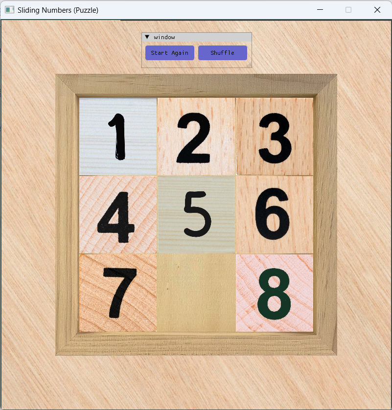

## SlidingNumbers

SlidingNumbers game, made with modern OpenGL (3.3+)

## Building From Source

First, you should have "Desktop Development with C++" workload installed (via [visual studio installer](https://learn.microsoft.com/en-us/cpp/build/vscpp-step-0-installation?view=msvc-170#step-4---choose-workloads)).

Next, make sure powershell is recognized by cmd,
- Open cmd
- Run `pwsh --version`

Finally, building the project is straight foreword,
- Clone this repo, 
- Open .sln file with visual studio 2022 
- Run.

## Libraries Used

- [Glfw](https://github.com/glfw/glfw): Creates OpenGL window
- [Glad](https://github.com/Dav1dde/glad): Loads OpenGL functions
- [SFML](https://github.com/SFML/SFML): Plays audio files
- [stb](https://github.com/nothings/stb): Loads image files
- [ImGUI](https://github.com/ocornut/imgui): Adds Buttons to glfw window
- [GLM](https://github.com/g-truc/glm): Serves OpenGL mathematics